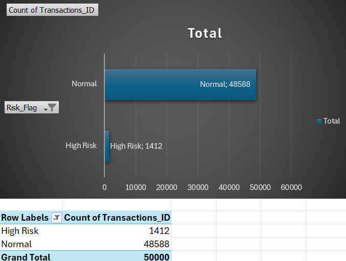
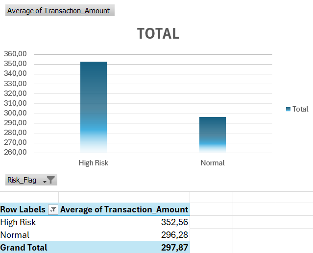
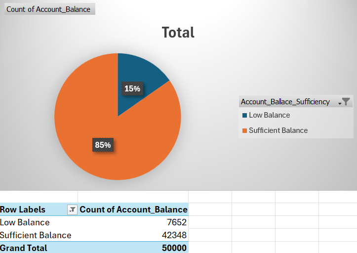

# Financial Transactions Risk Analysis — Excel

A rule-based risk analysis of 50,000 financial transactions using Microsoft Excel. The project applies multi-signal fraud detection logic through IF formulas, VLOOKUP lookups, and PivotTable dashboards.

Built as a portfolio project targeting data analytics roles in banking and financial services.

---

## Dataset

- **Source:** Kaggle — Financial Transactions Dataset
- **Size:** 50,000 rows
- **Key columns:** `AccountID`, `TransactionAmount`, `TransactionDate`, `TransactionType`, `Location`, `LoginAttempts`, `AccountBalance`, and more

---

## Objectives

- Flag transactions using rule-based risk logic across two independent signals
- Enrich flagged records with actionable classifications via VLOOKUP
- Visualise the distribution and financial impact of risk categories through PivotTable dashboards

---

## Methodology

### Signal 1 — Transaction Value Risk (`Risk_Flag`)

```excel
=IF(TransactionAmount > 100, "High Risk", "Normal")
```

Transactions above $100 are flagged as High Risk based on a defined monetary threshold.

**VLOOKUP enrichment — `Recommended_Action`:**

| Risk_Flag | Risk_Level | Recommended_Action |
|-----------|------------|--------------------|
| High Risk | Critical   | Manual Review      |
| Normal    | Low        | Auto-Approved      |

```excel
=VLOOKUP(Risk_Flag, RiskPolicyTable, 3, FALSE)
```

---

### Signal 2 — Account Health Risk (`Balance_Status`)

```excel
=IF(AccountBalance < 1000, "Low Balance", "Sufficient Balance")
```

Accounts with a balance below $1,000 are classified as elevated risk.

**VLOOKUP enrichment — `Balance_Action`:**

| Balance_Status     | Alert_Level | Action          |
|--------------------|-------------|-----------------|
| Low Balance        | Elevated    | Flag for Review |
| Sufficient Balance | Low         | No Action       |

```excel
=VLOOKUP(Balance_Status, BalancePolicyTable, 3, FALSE)
```

---

## Analysis & Results

### PivotTable 1 — Transaction Count by Risk Flag



| Risk_Flag | Count      |
|-----------|------------|
| High Risk | 1,412      |
| Normal    | 48,588     |
| **Total** | **50,000** |

~2.8% of transactions were flagged as High Risk.

---

### PivotTable 2 — Average Transaction Amount by Risk Flag



| Risk_Flag | Avg Transaction Amount |
|-----------|------------------------|
| High Risk | $352.56                |
| Normal    | $296.28                |

High Risk transactions carry a **~19% higher average value** than Normal transactions, confirming the threshold logic is directionally valid.

> *Note: The $100 threshold results in a low flag rate (2.8%). A more robust model could apply dynamic thresholds or incorporate additional signals such as login behaviour or account balance.*

---

### PivotTable 3 — Account Balance Distribution



| Balance_Status     | Count  | Share |
|--------------------|--------|-------|
| Low Balance        | 7,652  | 15%   |
| Sufficient Balance | 42,348 | 85%   |

15% of accounts fall below the $1,000 balance threshold, representing an independent risk layer beyond transaction size alone.

---

## Dual-Signal Risk Framework

| Signal            | Logic            | Risk Indicator        |
|-------------------|------------------|-----------------------|
| Transaction Value | Amount > $100    | High transaction risk |
| Account Health    | Balance < $1,000 | Elevated account risk |

Combining both signals enables a more complete fraud risk profile than either rule alone.

---

## Excel Features Used

| Feature     | Application                                    |
|-------------|------------------------------------------------|
| `IF`        | Rule-based risk classification                 |
| `VLOOKUP`   | Enrichment via policy reference tables         |
| PivotTables | Aggregation and summary analysis               |
| Charts      | Bar (count), Bar (average), Pie (distribution) |

---

## Project Structure

```
financial-transactions-risk-excel/
│
├── financial_transactions_risk_analysis.xlsx   # Main workbook
├── chart_risk_count.png                        # PivotTable 1 — count by risk flag
├── chart_avg_transaction.png                   # PivotTable 2 — avg transaction amount
├── chart_balance_distribution.png              # PivotTable 3 — balance distribution
└── README.md
```

---

## Key Takeaways

- Rule-based thresholds are simple to implement but require careful calibration — a low threshold like $100 flags few transactions (2.8%) while still capturing higher-value outliers
- Multi-signal analysis (transaction value + account balance) provides a more robust fraud detection baseline than a single rule
- VLOOKUP-based enrichment tables simulate the kind of policy reference logic used in real banking data pipelines

---

## Author

**Jan Siczyński**
Economics Student — Politechnika Gdańska
[GitHub](https://github.com/Jan-Siczynski) · [LinkedIn](https://linkedin.com/in/jan-siczyński)
